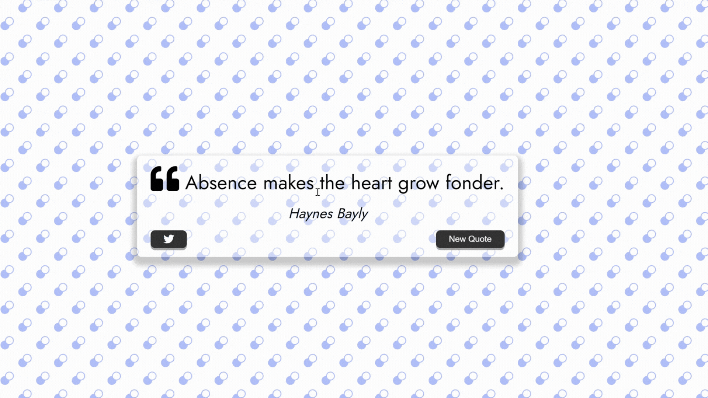

# Quote-Generator

Création d'un générateur de citations avec l'auteur de la citation ! 

- Fetch une api
- gestion des erreurs avec try & catch
- gestion de l'asynchrone avec async & await
- ajout d'un loader
- gestion de l'ajout sur twitter avec l'api twitter ! 

